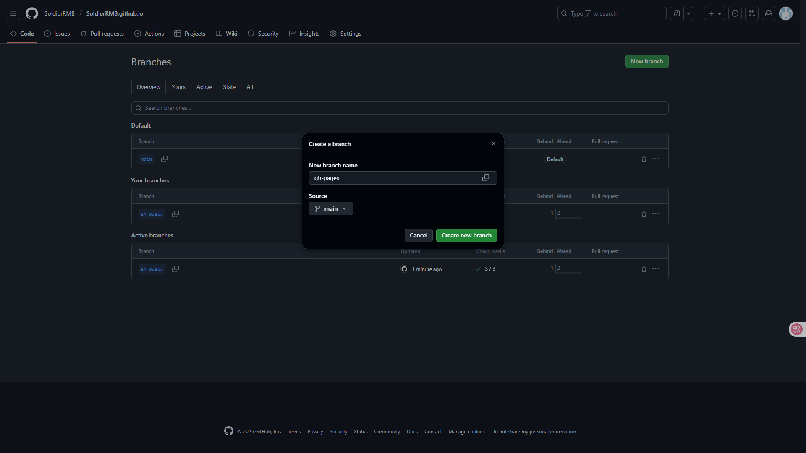
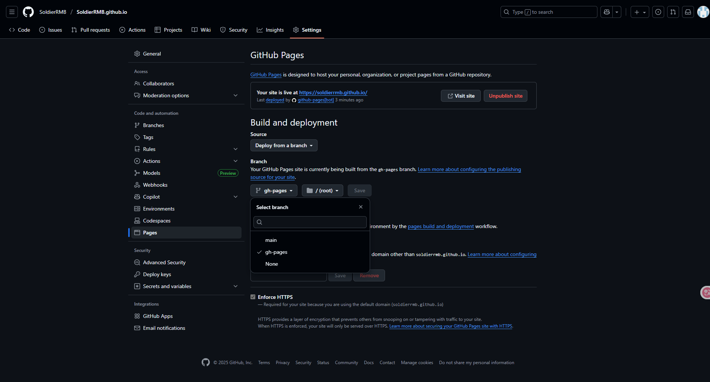
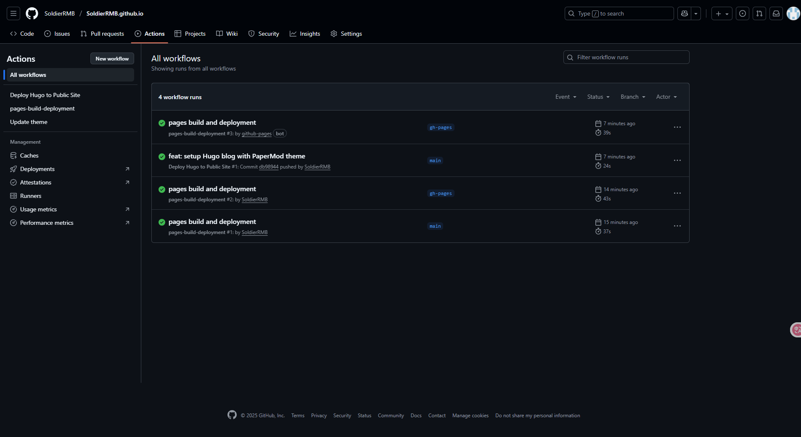
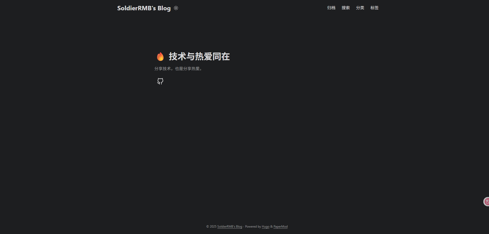

## 前言

Hugo 是一个使用 Go 语言开发的**静态网站生成器**，可以将 Markdown 文档转换成完整的 HTML 网站，非常适合用来作为博客建站。

本教程会展示完整的 Hugo 配置过程、配置 PaperMod 主题及主题汉化、主题自动更新，以及自动部署 GitHub Pages。

## 搭建过程

### 安装 Hugo

我这边使用 Windows 作为演示，使用 Winget 来安装：

```
winget install Hugo.Hugo.Extended
```

使用 `hugo version` 来验证安装，可以得到类似的输出，就是安装成功了：

```
hugo v0.149.0-66240338f1b908ca3b163384c8229943e74eb290+extended windows/amd64 BuildDate=2025-08-27T15:37:16Z VendorInfo=gohugoio
```

### 创建网站

选取你的工作目录，以此执行下面的命令，将 `YOUR_OWN_GIT_REPOSITORY` 替换为你的远程仓库，需要将仓库名称设置为 `<username>.github.io` 并设置为公开：

```
hugo new site blog
cd blog
git init
hugo mod init YOUR_OWN_GIT_REPOSITORY
```

修改 `hugo.toml` 添加如下内容，来配置 PaperMod 主题：

```
[[module.imports]]
path = "github.com/adityatelange/hugo-PaperMod"
```

使用 `hugo mod get -u` 来获取或更新主题

使用 `hugo server` 可以查看一下效果

### PaperMod 配置及汉化

1. 创建 `content/posts/_index.md`

```
---
title: "文章"
---
```

2. 创建 `content/archives.md`

```
---
title: "归档"
layout: "archives"
url: "/archives/"
summary: archives
---
```

3. 创建 `content/search.md`

```
---
title: "搜索"
layout: "search"
summary: "search"
---
```

4. 创建 `content/categories/_index.md`

```
---
title: "分类"
---
```

5. 创建 `content/tags/_index.md`

```
---
title: "标签"
---
```

可以参考一下我的 `hugo.toml` 配置，主要修改的就是标题、描述、关键词、作者、分类和标签页面的文本，开启封面图，我这边还禁用了 Hugo 自带的 Highlight，使用主题提供的高亮详细的配置项详见 [PaperMod Variables](https://github.com/adityatelange/hugo-PaperMod/wiki/Variables)：

```
baseURL = "https://soldierrmb.github.io"
languageCode = "zh-CN"
title = "SoldierRMB's Blog"
enableRobotsTXT = true
buildDrafts = false
buildFuture = false
buildExpired = false

# Read: https://github.com/adityatelange/hugo-PaperMod/wiki/FAQs#using-hugos-syntax-highlighter-chroma
pygmentsUseClasses = true

[[module.imports]]
path = "github.com/adityatelange/hugo-PaperMod"

[minify]
disableXML = true
minifyOutput = true

[params]
env = "production" # to enable google analytics, opengraph, twitter-cards and schema.
title = "SoldierRMB's Blog"
description = "软妹币战士的个人博客 - 分享技术，也是分享热爱"
keywords = ["软妹币战士", "博客", "Blog", "Hugo", "PaperMod"]
author = "软妹币战士"
# author = ["Me", "You"] # multiple authors
images = ["<link or path of image for opengraph, twitter-cards>"]
DateFormat = "January 2, 2006"
defaultTheme = "auto" # dark, light
disableThemeToggle = false
ShowReadingTime = true
ShowShareButtons = false
ShowPostNavLinks = true
ShowBreadCrumbs = true
ShowCodeCopyButtons = true
ShowWordCount = true
ShowRssButtonInSectionTermList = false
UseHugoToc = true
disableSpecial1stPost = false
disableScrollToTop = false
comments = false
hidemeta = false
hideSummary = false
showtoc = true
tocopen = false

[params.assets]
disableHLJS = true # to disable highlight.js
# disableFingerprinting = true
# favicon = "<link / abs url>"
# favicon16x16 = "<link / abs url>"
# favicon32x32 = "<link / abs url>"
# apple_touch_icon = "<link / abs url>"
# safari_pinned_tab = "<link / abs url>"

[params.label]
text = "SoldierRMB's Blog"
icon = "/apple-touch-icon.png"
iconHeight = 35

# profile-mode
[params.profileMode]
enabled = false # needs to be explicitly set
title = "SoldierRMB's Blog"
subtitle = "分享技术，也是分享热爱。"
imageUrl = ""
imageWidth = 120
imageHeight = 120
imageTitle = "my image"

[[params.profileMode.buttons]]
name = "Posts"
url = "posts"

[[params.profileMode.buttons]]
name = "Tags"
url = "tags"

# home-info mode
[params.homeInfoParams]
Title = "🔥 技术与热爱同在"
Content = "分享技术，也是分享热爱。"

[[params.socialIcons]]
name = "github"
url = "https://github.com/SoldierRMB"

[params.analytics.google]
SiteVerificationTag = "SoldierRMB's Blog"

[params.analytics.bing]
SiteVerificationTag = "SoldierRMB's Blog"

[params.analytics.yandex]
SiteVerificationTag = "SoldierRMB's Blog"

[params.cover]
hidden = true # hide everywhere but not in structured data
hiddenInList = false # hide on list pages and home
hiddenInSingle = false # hide on single page

# [params.editPost]
# URL = "https://github.com/<path_to_repo>/content"
# Text = "Suggest Changes" # edit text
# appendFilePath = true # to append file path to Edit link

# for search
# https://fusejs.io/api/options.html
[params.fuseOpts]
isCaseSensitive = false
shouldSort = true
location = 0
distance = 1_000
threshold = 0.4
minMatchCharLength = 0
limit = 10 # refer: https://www.fusejs.io/api/methods.html#search
keys = ["title", "permalink", "summary", "content"]

[outputs]
home = [ "HTML", "RSS", "JSON" ]

[languages.zh]
languageName = "中文"
weight = 1

[[menu.main]]
name = "归档"
url = "/archives/"
weight = 5

[[menu.main]]
name = "搜索"
url = "/search/"
weight = 10

[[menu.main]]
name = "分类"
url = "/categories/"
weight = 15

[[menu.main]]
name = "标签"
url = "/tags/"
weight = 20

[markup.highlight]
# noClasses = false
# anchorLineNos = true
codeFences = true
guessSyntax = true
lineNos = true
style = "monokai"

[markup.goldmark.renderer]
unsafe = true

```

### 使用 GitHub 托管博客

我们需要在 GitHub 上创建一个新的 `gh-pages` 分支来保存 Hugo 生成的静态页面  


然后再将 Pages 部署为刚刚创建的 `gh-pages` 分支  


#### 主题自动更新

创建一个 `.github/workflows` 目录，在这个目录中创建一个 `update-theme.yml` 文件，并将下面的内容粘贴进去，这样主题有更新的时候就会自动更新了：

```
name: Update theme

on:
  schedule:
    - cron: "0 0 * * *"
  workflow_dispatch:

jobs:
  update-theme:
    runs-on: ubuntu-latest

    permissions:
      contents: write

    steps:
      - uses: actions/checkout@v5

      - name: Setup Hugo
        uses: peaceiris/actions-hugo@v3
        with:
          hugo-version: 0.149.0
          extended: true

      - name: Update theme
        run: hugo mod get -u github.com/adityatelange/hugo-PaperMod

      - name: Tidy go.mod, go.sum
        run: hugo mod tidy

      - name: Commit changes
        uses: stefanzweifel/git-auto-commit-action@v6
        with:
          commit_message: "ci: update theme"
```

#### 部署 GitHub Pages

在 `.github/workflows` 目录下创建一个 `deploy.yml` 文件，并将下面的内容粘贴进去，`repository-name` 要修改为你自己的 `<username>.github.io`，分支名也要确认和你自 Pages 仓库的分支是否一致：

```
name: Deploy Hugo to Public Site

on:
  push:
    branches: [main]

jobs:
  build-and-deploy:
    runs-on: ubuntu-latest
    permissions:
      contents: write
      pages: write
      id-token: write

    steps:
      - uses: actions/checkout@v5
        with:
          fetch-depth: 0

      - name: Cache Go modules
        uses: actions/cache@v4
        with:
          path: |
            ~/.cache/go-build
            ~/go/pkg/mod
          key: ${{ runner.os }}-go-${{ hashFiles('**/go.sum') }}
          restore-keys: |
            ${{ runner.os }}-go-

      - name: Cache Hugo resources
        uses: actions/cache@v4
        env:
          cache-name: cache-hugo-resources
        with:
          path: resources
          key: ${{ runner.os }}-hugo-resources-${{ env.cache-name }}
          restore-keys: |
            ${{ runner.os }}-hugo-resources-${{ env.cache-name }}

      - uses: actions/setup-go@v6
        with:
          go-version: "^1.25.1"
      - run: go version
      - name: Go Get Modules
        run: go mod tidy && go mod download

      - name: Setup Hugo
        uses: peaceiris/actions-hugo@v3
        with:
          hugo-version: "latest"
          extended: true

      - name: Build Hugo
        run: hugo --minify --gc

      - name: Deploy to GitHub Pages 🚀
        uses: JamesIves/github-pages-deploy-action@v4
        with:
          token: ${{ secrets.GITHUB_TOKEN }}
          branch: "gh-pages"
          folder: "public"
          clean: true
          force: true
```

#### 验证效果

将本地分支推送到远程后，会自动触发 GitHub Actions 部署到 GitHub Pages  


访问 `https://<username>.github.io` 就可以访问博客了  

